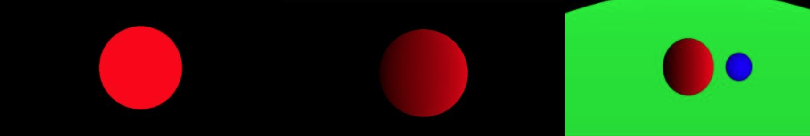

# Lab 12 - Ray tracer

> "A technique that can complement or replace Opengl!"

**Lab materials must be pushed to your repository one week from now before the next class begins**

**Read:** *Labs are designed to be finished in class if you work diligently, but expected to take 1-2 hours outside of class. They are often more 'tutorial' in style, and sometimes the solution may even be provided in pieces for you to type in and experiment. Copying & Pasting is discouraged however--make mistakes, play, and you will further learn the material.*

# Logistics

You will be working on your own laptop today.

# Resources to help

- https://raytracing.github.io/books/RayTracingInOneWeekend.html
  - Peter Shirley book (Ray Tracing in a Weekend)
  - This is your guide for completing the lab today

# Description

For this lab your goal is to create your first ray tracer! This lab may be a little weird in that it is more self-guided compared to our previous labs. What I have instead tried to provide, is a set of support code to get us up and running. The expectation is you will use the [Ray Tracing in a Weekend](https://raytracing.github.io/books/RayTracingInOneWeekend.html) book by Peter Shirley to get you up and running. The book is roughly 23 pages of reading (i.e. the first 6 chapters) for you to complete the above scene. You do not have to use the support code if you would like to do something different. I have deviated slightly in the book in my abstraction, but you are welcome to learn from Peter Shirley's and use your own.

# Submission/Deliverables

### Submission

- Commit all of your files to github, including any additional files you create.
- Do not commit any binary files unless told to do so.
- Do not commit any 'data' files generated when executing a binary.

### Deliverables

1. A scene with at least 3 spheres rendered.

# Rubric

You (and any partner(s)) will receive the same grade from a scale of 0-2.

- 0 for no work completed by the deadline
- 1 for some work completed, but something is not working properly
- 2 for a completed lab (with possible 'going further' options completed)

# Going Further

What is that, you finished Early? Did you enjoy this lab? Here are some (optional) ways to further this assignment.

- Finish reading and implementing the Peter Shirley Book.

# F.A.Q. (Instructor Anticipated Questions)

1. Question: Can I add more and complete the book?
2. Answer: Yes, that is what we will be doing in the next lecture.

# Found a bug?

If you found a mistake (big or small, including spelling mistakes) in this lab, kindly send me an e-mail. It is not seen as nitpicky, but appreciated! (Or rather, future generations of students will appreciate it!)

- Fun fact: The famous computer scientist Donald Knuth would pay folks one $2.56 for errors in his published works. [[source](https://en.wikipedia.org/wiki/Knuth_reward_check)]
- Unfortunately, there is no monetary reward in this course :)
